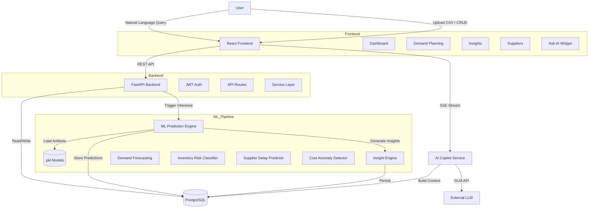
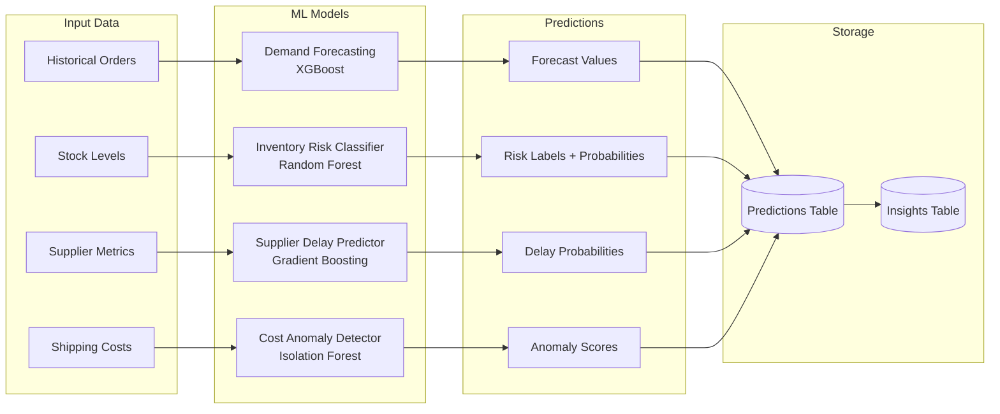
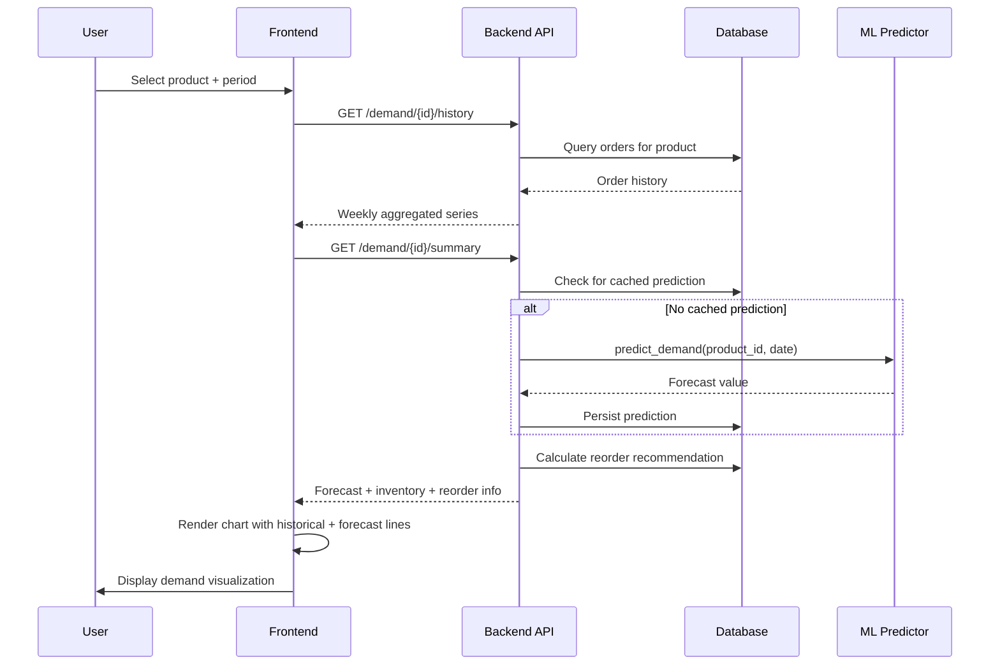

# FlowChain AI

An ML-powered supply chain management platform with predictive intelligence and a natural language AI copilot.

Built for the **OpenAI x Outskill AI Builders Hackathon**.

---

## What It Does

FlowChain transforms raw supply chain data into predictive insights. Instead of just showing what happened, it forecasts what's coming — demand spikes, inventory risks, supplier delays, and cost anomalies. On top of that, an AI copilot lets users ask questions in plain English and get grounded, data-backed answers.

---

## Architecture



---

## ML Prediction Pipeline



---

## Data Flow — Demand Planning



---

## Features

### Dashboard
- KPI cards: total products, inventory health, stock risks, supplier risks
- Top insights with severity indicators
- AI copilot widget for natural language queries

### Demand Planning
- Product-level demand history with weekly/monthly/quarterly aggregation
- ML-powered demand forecasting
- Reorder recommendations with urgency classification
- Interactive Recharts visualizations

### Predictive Intelligence
- **Demand Forecasting** — XGBoost model predicting future product demand
- **Inventory Risk Classification** — Random Forest classifying stock as HEALTHY / RISK / OVERSTOCK
- **Supplier Delay Prediction** — Gradient Boosting estimating delay probability
- **Cost Anomaly Detection** — Isolation Forest flagging unusual shipping costs

### AI Copilot
- Natural language queries over supply chain data
- Streaming responses via Server-Sent Events
- Context-aware: grounded in real database values
- Rate-limited to prevent abuse

### Insights Engine
- Automated insight generation from ML predictions
- Severity classification (critical / high / medium / low)
- Acknowledge / resolve workflow
- AI-generated insights via GLM API

---

## Tech Stack

| Layer | Technology |
|-------|-----------|
| Frontend | React, TypeScript, Vite, Tailwind CSS, Recharts |
| Backend | FastAPI, SQLAlchemy, Alembic, PostgreSQL |
| ML | scikit-learn, XGBoost, Pandas, NumPy |
| AI | GLM API (OpenAI-compatible), Server-Sent Events |
| Auth | JWT, bcrypt, multi-tenant isolation |

---

## Getting Started

### Backend

```bash
cd backend
python -m venv venv
venv\Scripts\activate
pip install -r requirements.txt
uvicorn app.main:app --reload
```

### Frontend

```bash
cd frontend
npm install
npm run dev
```

### ML Training

```bash
python ml/training/train_models.py --all
```

---

## Project Structure

```
FlowChainAI/
├── backend/
│   ├── app/
│   │   ├── api/            # FastAPI route handlers
│   │   ├── core/           # Config, auth, exceptions
│   │   ├── ml/             # ML models, inference, evaluation
│   │   ├── models/         # SQLAlchemy ORM models
│   │   ├── schemas/        # Pydantic request/response schemas
│   │   └── services/       # Business logic + AI services
│   └── requirements.txt
├── frontend/
│   ├── src/
│   │   ├── components/     # Reusable UI components
│   │   ├── hooks/          # Custom React hooks
│   │   ├── layouts/        # App shell, sidebar, topbar
│   │   ├── pages/          # Route-level page components
│   │   └── services/       # API client + endpoints
│   └── package.json
├── ml/
│   ├── training/           # Model training scripts
│   ├── inference/          # Batch prediction
│   ├── evaluation/         # Model evaluation
│   └── notebooks/          # Jupyter notebooks
├── data/
│   ├── raw/                # Raw datasets
│   ├── processed/          # Cleaned data
│   └── samples/            # Seed data (Superstore CSV)
└── docs/                   # Documentation
```

---

## Documentation

Detailed documentation is available in the [`docs/`](./docs/) folder:

- [API Reference](./docs/api_reference.md) — All endpoints with request/response examples
- [ML Models](./docs/ml_models.md) — Model architecture, training, and inference details
- [Architecture](./docs/architecture.md) — System design and component diagrams
- [ML Integration](./docs/ml_integration.md) — Integration walkthrough and fixes
- [AI Prompts](./docs/prompts/) — System prompts for the AI copilot

---

## License

MIT
