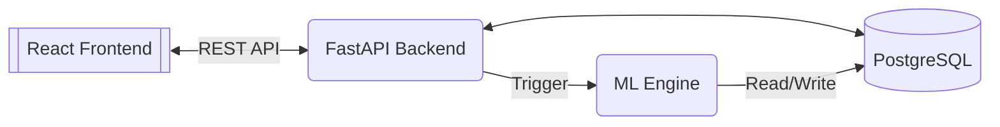

# ChainPilot - AI-Powered Supply Chain Management Platform

ChainPilot is an advanced SaaS platform designed to optimize supply chain operations through machine learning. It provides demand forecasting, inventory risk analysis, and supplier delay prediction, all integrated into a modern, real-time dashboard.



## Key Features

*   **Machine Learning Insights**:
    *   **Demand Forecasting**: Predicts future product demand using historical data.
    *   **Inventory Risk**: Identifies products at risk of stockouts or overstock.
    *   **Supplier Delay Prediction**: Estimates the probability of shipment delays.
*   **Data Management**:
    *   **CSV Data Upload**: Import inventory and product data via CSV with immediate ML analysis triggers.
    *   **Inventory Tracking**: Real-time tracking of stock levels across warehouses.
    *   **Supplier Management**: Track supplier reliability and performance.
*   **Modern Dashboard**:
    *   Interactive charts and KPI metrics.
    *   Actionable insights "Needs Attention" feed.

## Technology Stack

*   **Backend**: Python, FastAPI, SQLAlchemy, PostgreSQL.
*   **Machine Learning**: Scikit-Learn, Pandas, NumPy.
*   **Frontend**: React (Vite), TypeScript, TailwindCSS.

## Installation & Setup

### Prerequisites
*   Python 3.10+
*   Node.js 18+
*   PostgreSQL
*   Git

### 1. Clone the Repository
```bash
git clone git@github.com:adityasync/ChainPilot.git
cd ChainPilot
```

### 2. Backend Setup
```bash
cd backend
python -m venv venv
source venv/bin/activate
pip install -r requirements.txt
# Start the server
uvicorn app.main:app --reload
```
The API will be available at `http://localhost:8000`. API docs at `/docs`.

### Neon Quick Start

This backend already reads `DATABASE_URL` from the repo-root `.env` file in [backend/app/database.py](/E:/adityap/ChainPilot/backend/app/database.py:1).

1. Create a Neon project, then open `Connect` in the Neon dashboard and copy a Postgres connection string.
2. Put it in the repo-root `.env` file:

```bash
DATABASE_URL="postgresql://<user>:<password>@<hostname>/<database>?sslmode=require&channel_binding=require"
```

3. Install backend dependencies and start the API:

```bash
cd backend
python -m venv venv
venv\Scripts\activate
pip install -r requirements.txt
uvicorn app.main:app --reload
```

Notes:
- Use a direct Neon connection string for this app's current startup path, because it creates tables on boot via SQLAlchemy.
- Use a pooled connection string only if you expect high concurrency; Neon pooled hostnames add `-pooler` to the endpoint.
- Do not commit real Neon credentials. Keep them in `.env` only.

### 3. Frontend Setup
```bash
cd frontend
npm install
npm run dev
```
The application will run at `http://localhost:5173`.

## Documentation
Detailed documentation is available in the `docs/` directory:
*   [Roadmap](docs/roadmap.md)
*   [Architecture](docs/architecture.md)
*   [ML Integration Walkthrough](docs/ml_integration.md)

## Contributing
1.  Fork the repository.
2.  Create a feature branch (`git checkout -b feature/amazing-feature`).
3.  Commit your changes (`git commit -m 'Add amazing feature'`).
4.  Push to the branch (`git push origin feature/amazing-feature`).
5.  Open a Pull Request.

## License
Distributed under the MIT License.
