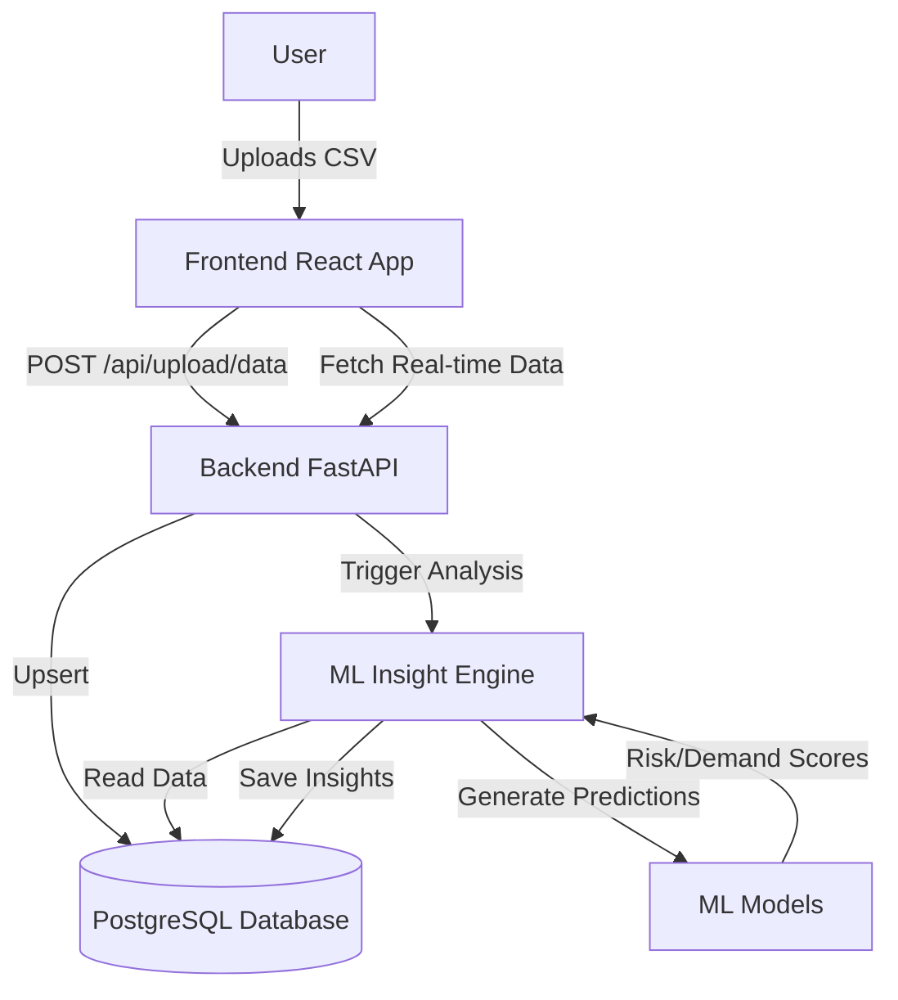
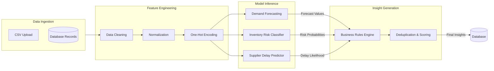
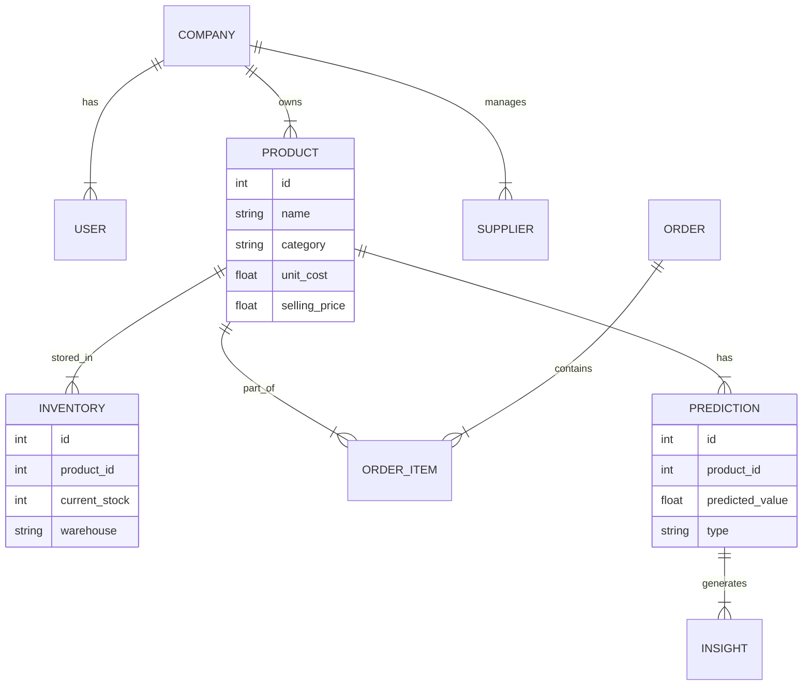
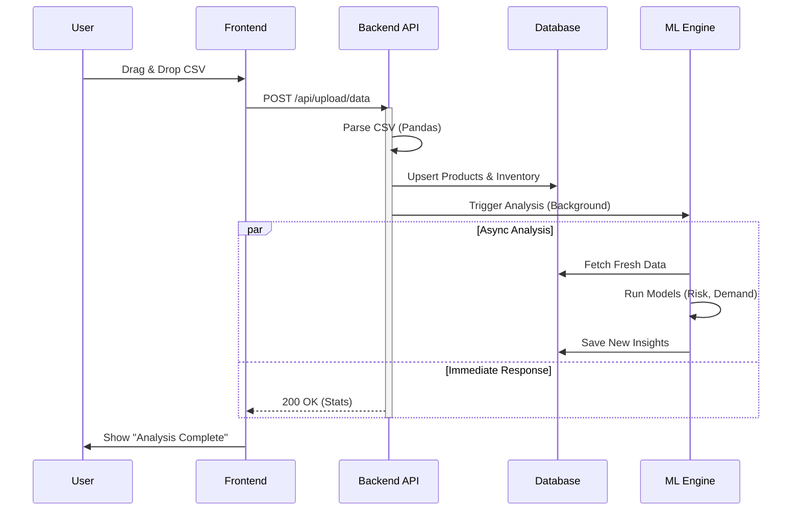
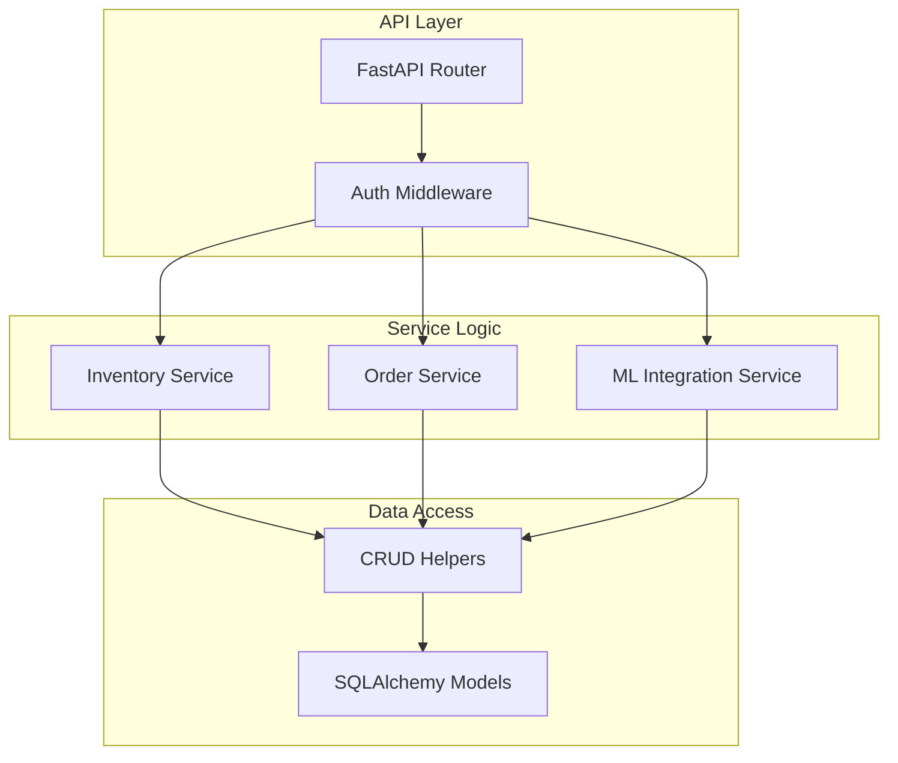

# Architecture & Implementation Plan

## Goal
Replace all hardcoded/mock data in the Frontend with real live data from the Backend APIs.

## Architecture

### System Overview

### ML Dataflow Pipeline

### Database Schema (ERD)

### Data Upload Sequence Flow

### Backend Component Architecture

## Verification Plan (Verified)
1.  **Dashboard**:
    -   Upload `test.csv` (2 products).
    -   Verify Dashboard says "2 products tracked". (Confirmed)
2.  **Inventory**:
    -   Verify table lists "Test Widget A" and "Test Widget B". (Confirmed)
3.  **Suppliers**:
    -   Verify seeded suppliers appear. (Confirmed)

## Implementation Details

### 1. Dashboard Integration
- Fetches real product count and insights stats.
- Dynamic "Inventory Health" calculation.

### 2. Inventory Page Integration
- Connected to `inventoryAPI.getProducts()`.
- Supports pagination structure.

### 3. Supplier Page Integration
- Connected to `supplierAPI.getSuppliers()`.

### 4. Data Upload Feature
- **Backend**: `POST /api/upload/data` (Pandas + SQLAlchemy).
- **Frontend**: `DataUploadPage` with Drag & Drop.
