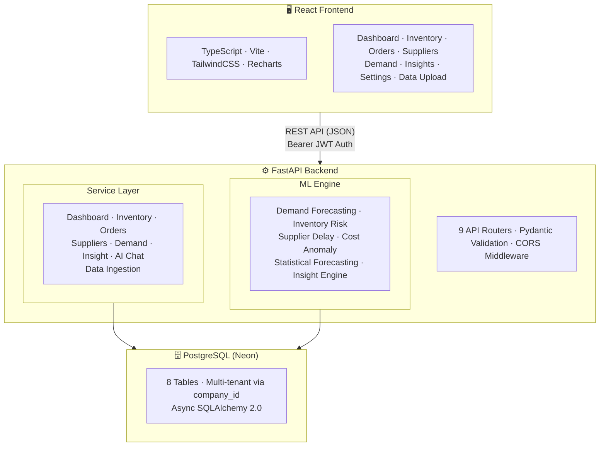
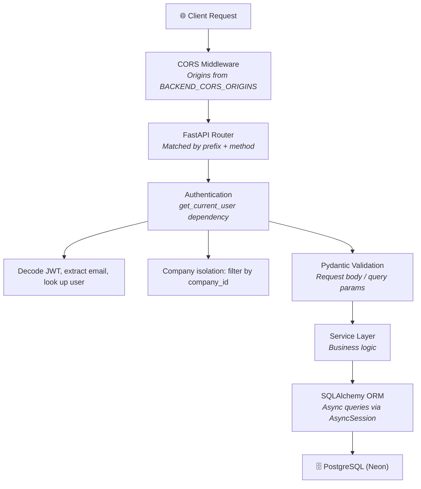
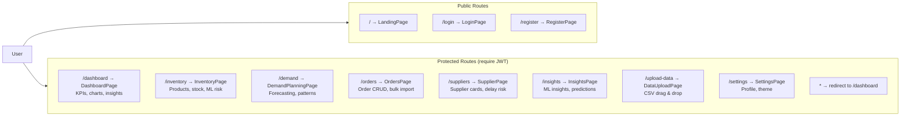
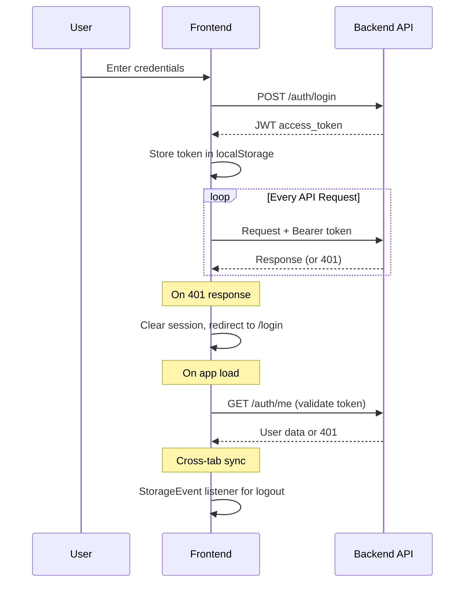
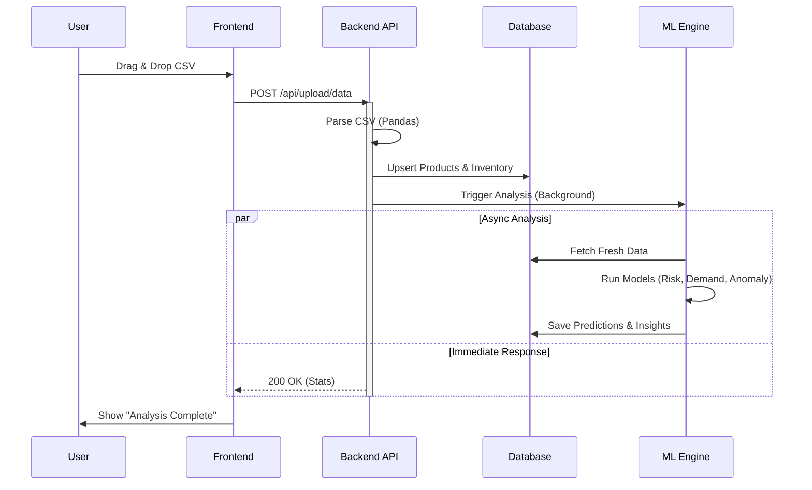
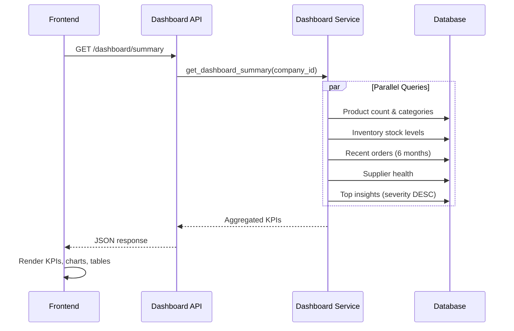
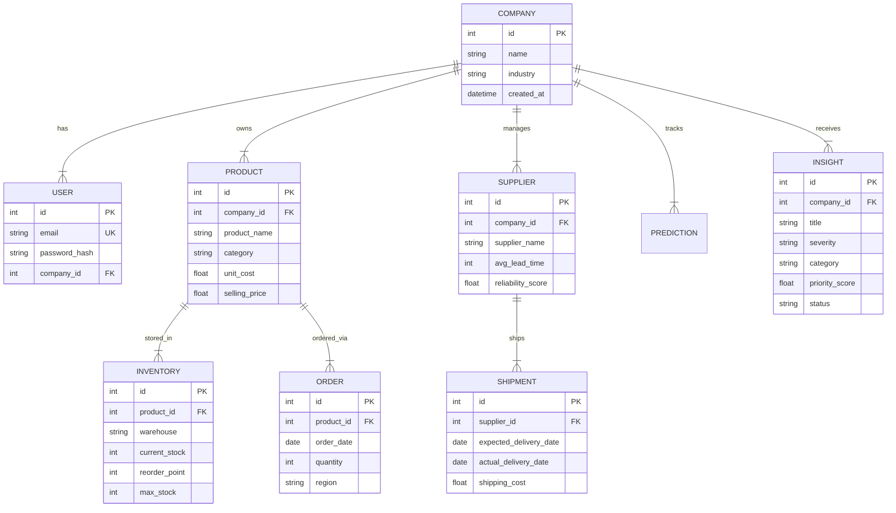

<p align="center">
  
</p>

<h1 align="center">Architecture</h1>

<p align="center">
  System design, data flow, and component architecture for ChainPilot.
</p>

---

## System Overview

ChainPilot is a full-stack SaaS platform with three major layers:



---

## Project Structure

```
ChainPilotAi/
├── backend/
│   ├── app/
│   │   ├── api/                    # Route handlers
│   │   │   ├── auth.py             # Register, login, JWT, profile
│   │   │   ├── inventory.py        # Products & stock CRUD
│   │   │   ├── orders.py           # Order management + bulk import
│   │   │   ├── supplier.py         # Suppliers & shipments CRUD
│   │   │   ├── demand.py           # Demand history, forecasting, accuracy
│   │   │   ├── ml_integration.py   # ML predictions & insights
│   │   │   ├── dashboard.py        # Aggregated KPIs
│   │   │   ├── ai.py               # AI chat & narratives
│   │   │   └── data_ingestion.py   # CSV upload & bulk processing
│   │   ├── core/
│   │   │   ├── config.py           # Environment variables
│   │   │   ├── security.py         # JWT + bcrypt password hashing
│   │   │   ├── exceptions.py       # Custom error classes
│   │   │   └── company_isolation.py # Multi-tenant data filtering
│   │   ├── models/                 # SQLAlchemy ORM models
│   │   │   ├── user_company.py     # User, Company
│   │   │   ├── product_inventory.py # Product, Inventory
│   │   │   ├── order.py            # Order
│   │   │   ├── supplier_shipment.py # Supplier, Shipment
│   │   │   └── ml_models.py        # Prediction, Insight
│   │   ├── schemas/                # Pydantic request/response models
│   │   ├── services/               # Business logic layer
│   │   │   ├── dashboard_service.py
│   │   │   ├── demand_service.py
│   │   │   ├── inventory_service.py
│   │   │   ├── supplier_service.py
│   │   │   ├── order_service.py
│   │   │   ├── insight_service.py
│   │   │   └── ai/                 # AI chat, narratives, context
│   │   ├── ml/                     # Machine learning pipeline
│   │   │   ├── models/             # Model classes + .pkl artifacts
│   │   │   ├── inference/          # Prediction orchestrator
│   │   │   ├── evaluation/         # Insight engine & explanations
│   │   │   ├── preprocessing/      # Data cleaning
│   │   │   ├── training/           # Training pipeline & data generation
│   │   │   └── startup.py          # Auto-training on boot
│   │   ├── database.py             # SQLAlchemy engine & session
│   │   ├── main.py                 # FastAPI app entry point
│   │   └── models.py               # Model registry
│   ├── Dockerfile
│   └── requirements.txt
├── frontend/
│   ├── src/
│   │   ├── pages/                  # Route pages (8 protected + 3 public)
│   │   ├── components/             # Reusable UI components
│   │   │   ├── Skeleton.tsx        # Skeleton loading states
│   │   │   ├── ProtectedRoute.tsx  # Auth route guard
│   │   │   ├── PaginationControls.tsx
│   │   │   ├── AskAI.tsx           # AI chat widget
│   │   │   └── landing/            # Landing page sections
│   │   ├── context/
│   │   │   ├── AuthContext.tsx      # Auth state & JWT management
│   │   │   └── ThemeContext.tsx     # Dark mode toggle
│   │   ├── services/
│   │   │   └── apiService.ts       # Axios API client
│   │   ├── hooks/                  # Custom React hooks
│   │   └── styles/                 # CSS animations & variables
│   ├── public/                     # Static assets
│   └── package.json
├── docs/                           # This documentation
├── ml/training/config.yaml         # ML hyperparameter config
├── render.yaml                     # Render deployment config
├── vercel.json                     # Vercel deployment config
└── .env.example                    # Environment template
```

---

## Backend Architecture

### Request Lifecycle



### Error Handling

All errors return a standardized JSON envelope:

```json
{
  "error": {
    "code": "NOT_FOUND",
    "message": "Product with id 42 not found",
    "field": "product_id"
  }
}
```

Exception hierarchy (`backend/app/core/exceptions.py`):

| Exception | HTTP Code | Use Case |
|---|---|---|
| `NotFoundError` | 404 | Resource doesn't exist |
| `UnauthorizedError` | 401 | Invalid/expired token |
| `ForbiddenError` | 403 | Insufficient permissions |
| `ValidationError` | 422 | Invalid input data |
| `ConflictError` | 409 | Duplicate resource |
| `RateLimitError` | 429 | Too many requests |
| `ServiceUnavailableError` | 503 | External service down |

### Multi-Tenancy

Every data query is scoped to the authenticated user's `company_id`:

```python
# Company isolation middleware
async def get_current_user_company_id(user = Depends(get_current_company_id)):
    return user.company_id

# All queries filter by company
products = await db.execute(
    select(Product).where(Product.company_id == company_id)
)
```

This ensures complete data isolation between companies sharing the same database.

---

## Frontend Architecture

### Routing



### Authentication Flow



### State Management

- **Auth**: `AuthContext` — user object, token, login/register/logout functions
- **Theme**: `ThemeContext` — dark mode toggle, persisted in localStorage
- **Page state**: Local `useState` per page (no global store like Redux)
- **API data**: Fetched on mount via `useEffect`, stored in component state

### Component Patterns

- **Skeleton loading**: All data-fetching pages show skeleton placeholders while loading
- **Floating labels**: Login/signup inputs use animated floating labels
- **Error boundaries**: `ErrorBoundary` component wraps protected routes
- **Pagination**: Shared `usePagination` hook + `PaginationControls` component
- **Modals**: Inline modal state per page (create, edit, delete confirmations)

---

## Data Flow Diagrams

### CSV Upload → ML Analysis



### Dashboard Data Flow



---

## Database Schema

See [database.md](database.md) for the complete schema reference.



---

## Technology Choices

| Decision | Choice | Rationale |
|---|---|---|
| **Backend framework** | FastAPI | Async support, auto-generated OpenAPI docs, Pydantic validation |
| **ORM** | SQLAlchemy 2.0 | Async sessions, mature ecosystem, migration support via Alembic |
| **Database** | PostgreSQL (Neon) | Serverless scaling, free tier, compatible with SQLAlchemy |
| **ML library** | scikit-learn + XGBoost | Wide algorithm coverage, joblib serialization, production-ready |
| **Frontend framework** | React 18 + TypeScript | Type safety, large ecosystem, Vite for fast dev builds |
| **Styling** | TailwindCSS | Utility-first, dark mode built-in, small bundle with purging |
| **Charts** | Recharts | React-native SVG charts, composable API, good tooltip support |
| **AI provider** | GLM (ZhipuAI) | OpenAI-compatible API, competitive pricing, streaming support |

---

## Related Documentation

- [API Reference](api_reference.md) — Complete endpoint documentation
- [Database Schema](database.md) — Tables, columns, relationships
- [ML Integration](ml_integration.md) — Model architecture & training
- [Deployment](deployment.md) — Render + Vercel setup
- [Frontend Guide](frontend.md) — Component architecture & patterns
- [Roadmap](roadmap.md) — Development timeline & future plans
