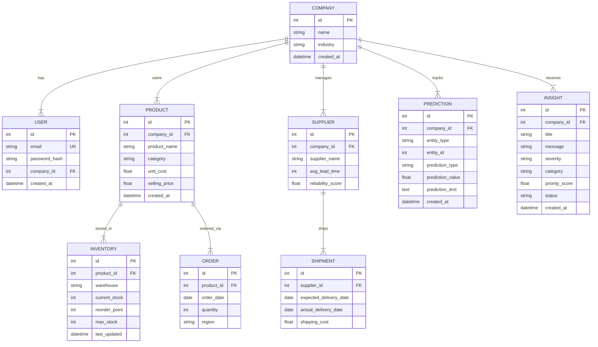
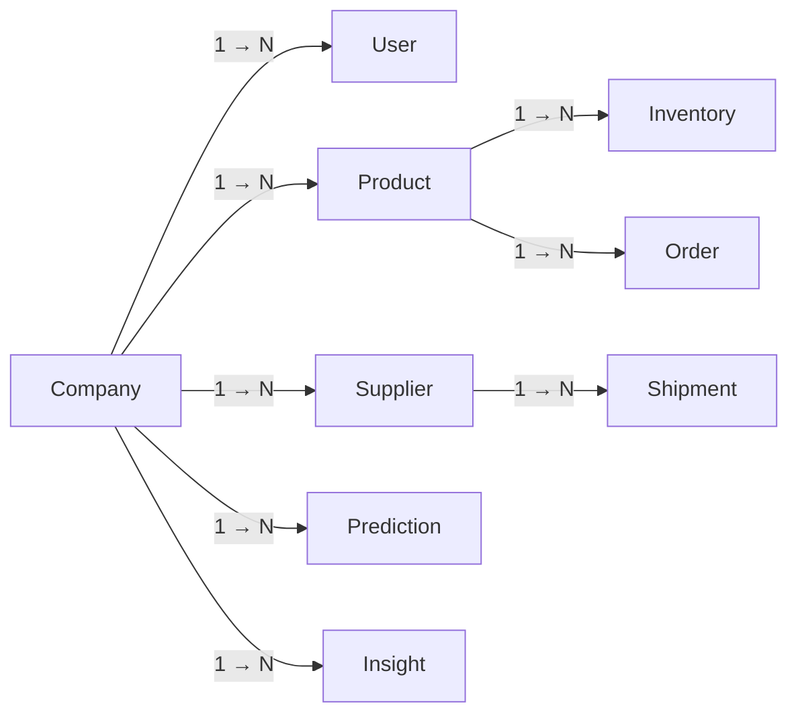

<p align="center">
  
</p>

<h1 align="center">Database Schema</h1>

<p align="center">
  PostgreSQL tables, columns, constraints, and relationships.
</p>

---

## Overview

ChainPilot uses **PostgreSQL** (Neon serverless) with **SQLAlchemy 2.0** async ORM.

- **8 tables** total
- **Multi-tenant** — all data scoped by `company_id`
- **Cascade deletes** — removing a company removes all its data
- **Auto-created** — tables created on first boot via `Base.metadata.create_all`

---

## Entity Relationship Diagram



---

## Table Reference

### `companies`

Root entity for multi-tenancy. All data belongs to a company.

**File**: `backend/app/models/user_company.py`

| Column | Type | Constraints | Description |
|---|---|---|---|
| `id` | Integer | PK, auto-increment | Company ID |
| `name` | String | NOT NULL | Company name |
| `industry` | String | nullable | Industry sector |
| `created_at` | DateTime(tz) | server_default=now() | Creation timestamp |

**Relationships:**
- `users` — 1:N, cascade delete
- `products` — 1:N, cascade delete
- `suppliers` — 1:N, cascade delete
- `predictions` — 1:N, cascade delete
- `insights` — 1:N, cascade delete

---

### `users`

User accounts linked to companies.

**File**: `backend/app/models/user_company.py`

| Column | Type | Constraints | Description |
|---|---|---|---|
| `id` | Integer | PK, auto-increment | User ID |
| `email` | String | UNIQUE, indexed, NOT NULL | Login email |
| `password_hash` | String | NOT NULL | bcrypt hash (12 rounds) |
| `company_id` | Integer | FK → companies.id, CASCADE | Parent company |
| `created_at` | DateTime(tz) | server_default=now() | Creation timestamp |

**Indexes:**
- Unique index on `email`

---

### `products`

Product catalog.

**File**: `backend/app/models/product_inventory.py`

| Column | Type | Constraints | Description |
|---|---|---|---|
| `id` | Integer | PK, auto-increment | Product ID |
| `company_id` | Integer | FK → companies.id, CASCADE | Parent company |
| `product_name` | String | NOT NULL | Product name |
| `category` | String | nullable | Product category |
| `unit_cost` | Float | NOT NULL, ≥ 0 | Cost per unit |
| `selling_price` | Float | NOT NULL, ≥ 0 | Selling price |
| `created_at` | DateTime(tz) | server_default=now() | Creation timestamp |

**Relationships:**
- `company` — N:1
- `inventory_items` — 1:N, cascade delete
- `orders` — 1:N, cascade delete

---

### `inventory`

Stock levels per product per warehouse.

**File**: `backend/app/models/product_inventory.py`

| Column | Type | Constraints | Description |
|---|---|---|---|
| `id` | Integer | PK, auto-increment | Item ID |
| `product_id` | Integer | FK → products.id, CASCADE | Parent product |
| `warehouse` | String | NOT NULL | Warehouse name |
| `current_stock` | Integer | NOT NULL, ≥ 0 | Current stock count |
| `reorder_point` | Integer | NOT NULL, ≥ 0 | Reorder threshold |
| `max_stock` | Integer | NOT NULL, > 0 | Maximum capacity |
| `last_updated` | DateTime(tz) | server_default=now(), onupdate=now() | Last modification |

**Validation:** `reorder_point` < `max_stock`

**Relationships:**
- `product` — N:1

---

### `orders`

Order records linked to products.

**File**: `backend/app/models/order.py`

| Column | Type | Constraints | Description |
|---|---|---|---|
| `id` | Integer | PK, auto-increment | Order ID |
| `product_id` | Integer | FK → products.id, CASCADE | Ordered product |
| `order_date` | Date | NOT NULL, default=today | Order date |
| `quantity` | Integer | NOT NULL, > 0 | Order quantity |
| `region` | String | nullable | Geographic region |

**Relationships:**
- `product` — N:1

---

### `suppliers`

Supplier directory.

**File**: `backend/app/models/supplier_shipment.py`

| Column | Type | Constraints | Description |
|---|---|---|---|
| `id` | Integer | PK, auto-increment | Supplier ID |
| `company_id` | Integer | FK → companies.id, CASCADE | Parent company |
| `supplier_name` | String | NOT NULL | Supplier name |
| `avg_lead_time` | Integer | nullable, > 0 | Average lead time (days) |
| `reliability_score` | Float | nullable, 0–1 | Reliability rating |

**Relationships:**
- `company` — N:1
- `shipments` — 1:N, cascade delete

---

### `shipments`

Shipment records linked to suppliers.

**File**: `backend/app/models/supplier_shipment.py`

| Column | Type | Constraints | Description |
|---|---|---|---|
| `id` | Integer | PK, auto-increment | Shipment ID |
| `supplier_id` | Integer | FK → suppliers.id, CASCADE | Parent supplier |
| `expected_delivery_date` | Date | NOT NULL | Expected delivery |
| `actual_delivery_date` | Date | nullable | Actual delivery |
| `shipping_cost` | Float | NOT NULL, ≥ 0 | Shipping cost |

**Relationships:**
- `supplier` — N:1

---

### `predictions`

ML prediction records.

**File**: `backend/app/models/ml_models.py`

| Column | Type | Constraints | Description |
|---|---|---|---|
| `id` | Integer | PK, auto-increment | Prediction ID |
| `company_id` | Integer | FK → companies.id, CASCADE | Parent company |
| `entity_type` | String | NOT NULL | "product" or "supplier" |
| `entity_id` | Integer | NOT NULL | Related entity ID |
| `prediction_type` | String | NOT NULL | Type of prediction |
| `prediction_value` | Float | nullable | Numeric prediction |
| `prediction_text` | Text | nullable | AI narrative text |
| `created_at` | DateTime(tz) | server_default=now() | Creation timestamp |

**Common `prediction_type` values:**
- `demand_forecast` — predicted demand quantity
- `inventory_risk` — risk classification
- `supplier_delay` — delay probability
- `cost_anomaly` — anomaly detection result

---

### `insights`

ML-generated business insights.

**File**: `backend/app/models/ml_models.py`

| Column | Type | Constraints | Description |
|---|---|---|---|
| `id` | Integer | PK, auto-increment | Insight ID |
| `company_id` | Integer | FK → companies.id, CASCADE | Parent company |
| `title` | String | NOT NULL | Insight title |
| `message` | String | NOT NULL | Detailed message |
| `severity` | String | NOT NULL | low / medium / high / critical |
| `entity_type` | String | nullable | Related entity type |
| `entity_id` | Integer | nullable | Related entity ID |
| `category` | String | nullable | inventory / supplier / cost / demand |
| `confidence_score` | Float | nullable, 0–1 | ML confidence |
| `explanation` | Text | nullable | Human-readable explanation |
| `recommended_action` | Text | nullable | Suggested action |
| `expected_impact` | String | nullable | Impact description |
| `urgency_level` | String | nullable | Urgency classification |
| `priority_score` | Float | nullable | Weighted priority (0–4) |
| `status` | String | default='new' | new / acknowledged / resolved / expired |
| `acknowledged_at` | DateTime(tz) | nullable | When acknowledged |
| `resolved_at` | DateTime(tz) | nullable | When resolved |
| `expired_at` | DateTime(tz) | nullable | When expired |
| `prediction_details` | String | nullable | JSON metadata |
| `created_at` | DateTime(tz) | server_default=now() | Creation timestamp |

**Lifecycle:** `new` → `acknowledged` → `resolved` (or auto-`expired`)

**Auto-expiry:** Critical insights expire after 7 days, others after 30 days.

---

## Relationships Summary



All parent-child relationships use **CASCADE delete** — removing a parent automatically removes all children.

---

## Migrations

Alembic is included in `requirements.txt` but no migration directory exists yet. Tables are created via `Base.metadata.create_all` on application startup.

**To set up Alembic:**
```bash
cd backend
alembic init alembic
alembic revision --autogenerate -m "initial"
alembic upgrade head
```

---

## Related Documentation

- [Architecture](architecture.md) — System overview
- [API Reference](api_reference.md) — Endpoint documentation
- [ML Integration](ml_integration.md) — Predictions & insights
- [Deployment](deployment.md) — Database setup
