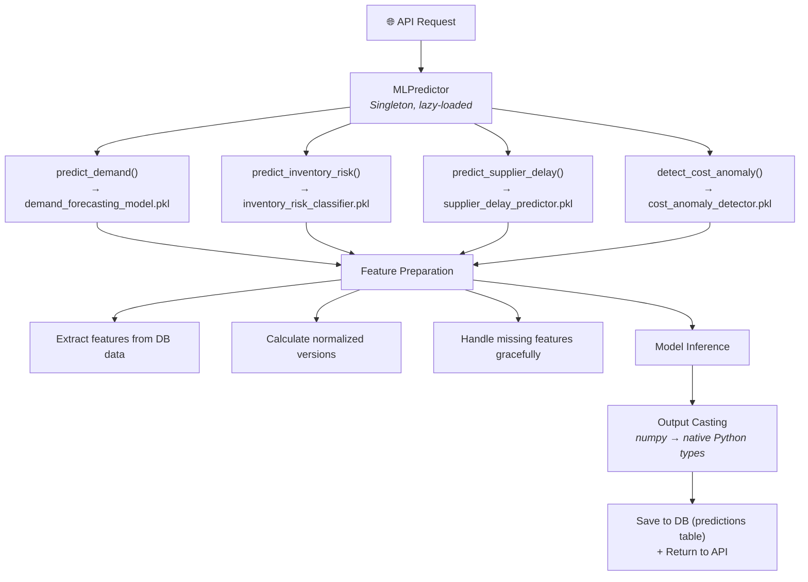
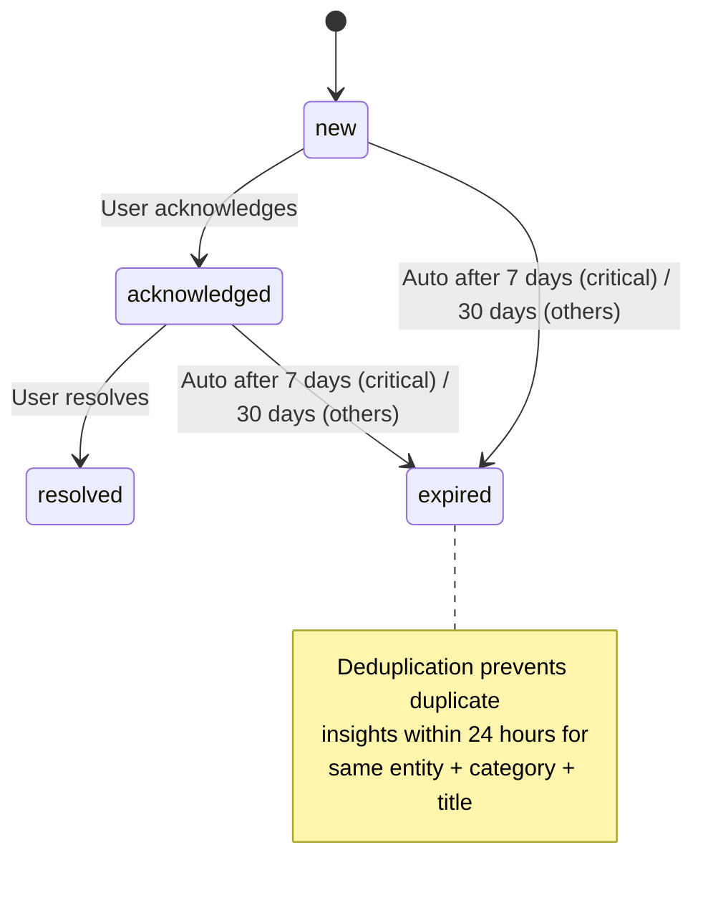

<p align="center">
  
</p>

<h1 align="center">ML Integration</h1>

<p align="center">
  Machine learning models, training pipeline, feature engineering, and insight generation.
</p>

---

## Overview

ChainPilot's ML engine provides five core capabilities:

| Capability | Model | Output |
|---|---|---|
| Demand Forecasting | Random Forest + XGBoost | Future order quantities |
| Inventory Risk | Random Forest Classifier | Risk category + probabilities |
| Supplier Delay | XGBoost Classifier | Delay probability (0–1) |
| Cost Anomaly | Isolation Forest | Anomaly flag + score |
| Statistical Forecast | EWMA + Linear Trend | Forecast + confidence bands |

Models are stored as `.pkl` files in `backend/app/ml/models/` and loaded lazily on first request.

---

## Model Architecture

### 1. Demand Forecasting (`demand_forecasting_model.pkl`)

**File**: `backend/app/ml/models/demand_forecasting.py`

Predicts future product demand from historical order data.

| Property | Value |
|---|---|
| **Algorithms** | LinearRegression + RandomForestRegressor |
| **Primary model** | Random Forest (n_estimators=100) |
| **Target** | Order quantity |
| **Training data** | Historical orders grouped by product + date |

**Features:**

| Feature | Description |
|---|---|
| `year` | Order year |
| `month` | Order month (1–12) |
| `day_of_week` | Day of week (0–6) |
| `quarter` | Quarter (1–4) |
| `product_encoded` | Product ID label encoding |

**Usage:**
```python
predictor = MLPredictor()
demand = predictor.predict_demand(product_id=1, date="2025-06-01")
# Returns: float (predicted quantity)
```

---

### 2. ML Demand Forecaster (`demand_ml/product_{id}.pkl`)

**File**: `backend/app/ml/models/ml_demand_forecaster.py`

Advanced per-product forecasting using XGBoost with rich time-series features.

| Property | Value |
|---|---|
| **Algorithm** | XGBRegressor |
| **Hyperparameters** | n_estimators=100, max_depth=4, learning_rate=0.1 |
| **Target** | Next month's quantity (shifted -1) |
| **Requirement** | ≥ 12 months of order history |
| **Artifacts** | Per-product files: `demand_ml/product_{id}.pkl` |

**Features (22 total):**

| Category | Features |
|---|---|
| **Lag** | t-1, t-2, t-3, t-6, t-12 |
| **Rolling stats** | Mean (3m, 6m, 12m), Std (3m, 6m) |
| **Trend** | Slope (3m, 6m) |
| **Deviation** | Dev from 3m mean, ratio to 12m mean |
| **Variability** | Coefficient of variation (6m) |
| **Seasonal** | Month sin/cos encoding, quarter |

**Capabilities:**
- Multi-step forecasting (recursive prediction)
- Demand pattern classification:
  - `stable` — low variance, flat trend
  - `trending_up` / `trending_down` — significant slope
  - `seasonal` — periodic peaks
  - `erratic` — high variance, no pattern
  - `intermittent` — sporadic demand
- Anomaly detection (>2 sigma from 6-month rolling mean)

---

### 3. Inventory Risk Classifier (`inventory_risk_classifier.pkl`)

**File**: `backend/app/ml/models/inventory_risk_classifier.py`

Classifies products into risk categories based on stock levels and demand patterns.

| Property | Value |
|---|---|
| **Algorithms** | RandomForestClassifier + LogisticRegression |
| **Primary model** | Random Forest (n_estimators=100) |
| **Target** | Risk label: "Stockout Risk", "Overstock Risk", "Normal" |
| **Training data** | Synthetic classification data (2000 samples) |

**Features:**

| Feature | Description |
|---|---|
| `Availability` | Stock availability percentage |
| `Number of products sold` | Sales volume |
| `Revenue generated` | Revenue from product |
| `Stock levels` | Current inventory count |
| `Lead times` | Supplier lead time (days) |
| `Order quantities` | Typical order size |
| `Shipping costs` | Per-unit shipping cost |
| `Price` | Selling price |
| `*_normalized` | Normalized versions (/100, /1000, etc.) |

**Output:**
```python
risk_label, probabilities = predictor.predict_inventory_risk(product_data)
# risk_label: "Stockout Risk" | "Overstock Risk" | "Normal"
# probabilities: [stockout_prob, overstock_prob, normal_prob]
```

---

### 4. Supplier Delay Predictor (`supplier_delay_predictor.pkl`)

**File**: `backend/app/ml/models/supplier_delay_predictor.py`

Predicts the probability of shipment delays for a supplier.

| Property | Value |
|---|---|
| **Algorithms** | LogisticRegression + RandomForest + XGBoost |
| **Primary model** | XGBoost |
| **Target** | Binary: delay (1) or on-time (0) |
| **Derived from** | `shipping_times > lead_times` |

**Features:**

| Feature | Description |
|---|---|
| `Lead times` | Average supplier lead time |
| `Order quantities` | Order size |
| `Shipping costs` | Shipping cost |
| `Price` | Product price |
| `Availability` | Stock availability |
| `Number of products sold` | Sales volume |
| `*_normalized` | Normalized versions |

**Output:**
```python
prediction, probability = predictor.predict_supplier_delay(supplier_data)
# prediction: 0 (on-time) or 1 (delayed)
# probability: float 0-1
```

---

### 5. Cost Anomaly Detector (`cost_anomaly_detector.pkl`)

**File**: `backend/app/ml/models/cost_anomaly_detector.py`

Detects unusual cost patterns that may indicate fraud, waste, or market shifts.

| Property | Value |
|---|---|
| **Algorithm** | IsolationForest |
| **Contamination** | 0.1 (10% expected anomaly rate) |
| **Output** | -1 (anomaly) or 1 (normal) + anomaly score |

**Features:** Shipping costs, products sold, price, order quantities, lead times.

---

### 6. Statistical Forecaster (no pre-training)

**File**: `backend/app/ml/models/statistical_forecaster.py`

Fallback forecaster that works on any product with order history, no training required.

| Property | Value |
|---|---|
| **Algorithm** | EWMA (α=0.3) + Linear Trend + Seasonal Indices |
| **Requirement** | Any product with ≥ 1 order |
| **Output** | Forecast + upper/lower confidence bounds |

**Output:**
```python
{
    "forecast_value": 145.2,
    "confidence_lower": 120.0,
    "confidence_upper": 170.4,
    "method": "ewma_trend_seasonal",
    "trend_slope": 2.3,
    "seasonal_indices": [0.9, 1.1, 1.0, ...]
}
```

---

## Prediction Pipeline

### Orchestrator

**File**: `backend/app/ml/inference/predictor.py` — `MLPredictor` class

Singleton pattern: loads all `.pkl` models once on first instantiation.

```python
class MLPredictor:
    def __init__(self):
        # Loads: demand_model, risk_classifier, delay_predictor, anomaly_detector
        pass
    
    def predict_demand(self, product_id, date) -> float
    def predict_inventory_risk(self, data) -> tuple[str, list[float]]
    def predict_supplier_delay(self, data) -> tuple[int, float]
    def detect_cost_anomaly(self, data) -> tuple[int, float]
    
    # Batch versions
    def batch_predict_demand(self, products, date) -> dict
    def batch_predict_inventory_risk(self, products) -> dict
    def batch_predict_supplier_delay(self, suppliers) -> dict
```

### Inference Flow



---

## Insight Generation

### Enhanced Insight Engine

**File**: `backend/app/ml/evaluation/enhanced_insight_engine.py`

Transforms raw ML predictions into actionable business insights.

**Pipeline:**
1. Run all ML models on company data
2. Classify each prediction into a category (inventory/supplier/cost/demand)
3. Assign severity (low/medium/high/critical) based on thresholds
4. Generate human-readable explanations
5. Recommend specific actions
6. Calculate priority score
7. Deduplicate against existing insights
8. Save to database

### Priority Scoring

```
priority_score = (severity × 0.4) + (urgency × 0.3) + (confidence × 0.2) + (time_decay × 0.1)
```

| Factor | Weight | Description |
|---|---|---|
| Severity | 40% | low=1, medium=2, high=3, critical=4 |
| Urgency | 30% | Based on time-to-impact |
| Confidence | 20% | Model prediction confidence |
| Time Decay | 10% | Newer insights score higher |

### Insight Lifecycle



### Explanation Generator

**File**: `backend/app/ml/evaluation/explanation_generator.py`

Two generators:
- `ExplanationGenerator` — human-readable text per (category, prediction_type)
- `RecommendationGenerator` — prescriptive actions with impact and timeline

---

## Training Pipeline

### Auto-Training at Startup

**File**: `backend/app/ml/startup.py` — `ensure_ml_ready()`

On backend boot:
1. Check if all 4 base `.pkl` files exist
2. Check if library versions match `.ml_versions.json` manifest
3. If missing or mismatched → retrain from synthetic CSV data
4. Version manifest tracks: scikit-learn, xgboost, pandas, numpy, joblib

### Synthetic Data Generation

**File**: `backend/app/ml/training/generate_data.py`

Generates two CSV files for training:

| File | Rows | Description |
|---|---|---|
| `demand_data.csv` | 50 products × 365 days | Order quantities with seasonality |
| `classification_data.csv` | 2000 samples | Risk labels + delay targets |

### Training Orchestrator

**File**: `backend/app/ml/training/trainer.py` — `MLTrainer` class

```python
trainer = MLTrainer()
trainer.train_demand_forecasting()       # → demand_forecasting_model.pkl
trainer.train_inventory_risk_classifier() # → inventory_risk_classifier.pkl
trainer.train_supplier_delay_predictor()  # → supplier_delay_predictor.pkl
trainer.train_cost_anomaly_detector()     # → cost_anomaly_detector.pkl
trainer.train_ml_demand_forecaster(db, company_id)  # → demand_ml/product_{id}.pkl
trainer.train_all_models()               # All of the above
```

### Training Config

**File**: `ml/training/config.yaml`

Documents hyperparameters, features, targets, and evaluation metrics for all models.

---

## Artifact Storage

| Artifact | Path | Serializer |
|---|---|---|
| Demand forecasting | `app/ml/models/demand_forecasting_model.pkl` | joblib |
| Inventory risk | `app/ml/models/inventory_risk_classifier.pkl` | joblib |
| Supplier delay | `app/ml/models/supplier_delay_predictor.pkl` | joblib |
| Cost anomaly | `app/ml/models/cost_anomaly_detector.pkl` | joblib |
| Per-product demand | `app/ml/models/demand_ml/product_{id}.pkl` | joblib |
| Version manifest | `app/ml/models/.ml_versions.json` | JSON |

**Version manifest** tracks library versions to detect when retraining is needed:
```json
{
  "scikit-learn": "1.5.2",
  "xgboost": "2.0.3",
  "pandas": "2.2.3",
  "numpy": "1.26.4",
  "joblib": "1.3.2"
}
```

---

## Key Files Reference

| File | Purpose |
|---|---|
| `ml/models/demand_forecasting.py` | Demand forecasting model class |
| `ml/models/ml_demand_forecaster.py` | Advanced XGBoost per-product forecaster |
| `ml/models/inventory_risk_classifier.py` | Inventory risk classifier |
| `ml/models/supplier_delay_predictor.py` | Supplier delay predictor |
| `ml/models/cost_anomaly_detector.py` | Cost anomaly detector |
| `ml/models/statistical_forecaster.py` | EWMA statistical forecaster |
| `ml/inference/predictor.py` | Prediction orchestrator (MLPredictor) |
| `ml/evaluation/enhanced_insight_engine.py` | Insight generation engine |
| `ml/evaluation/explanation_generator.py` | Human-readable explanations |
| `ml/preprocessing/data_cleaner.py` | Data cleaning utilities |
| `ml/training/trainer.py` | Training orchestrator |
| `ml/training/generate_data.py` | Synthetic data generation |
| `ml/startup.py` | Auto-training on boot |

---

## Related Documentation

- [Architecture](architecture.md) — System overview
- [API Reference](api_reference.md) — ML endpoint documentation
- [Database Schema](database.md) — Predictions & insights tables
- [Roadmap](roadmap.md) — ML improvement plans
