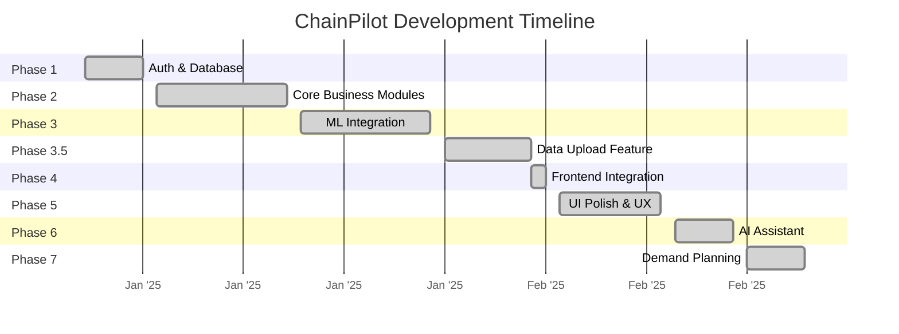

  

<h1 align="center">Roadmap</h1>

  Development timeline, completed milestones, and future plans.

---

## Development Timeline

---

## Completed Milestones

### Phase 1: Authentication & Database ✅

- [x] PostgreSQL database setup (Neon serverless)
- [x] User registration with company creation
- [x] JWT-based authentication (HS256, 30-min expiry)
- [x] bcrypt password hashing (12 rounds)
- [x] Multi-tenant company isolation
- [x] Cross-tab logout synchronization
- [x] Protected route middleware

### Phase 2: Core Business Modules ✅

- [x] **Inventory Management**
  - Product CRUD with category, pricing
  - Inventory stock tracking per warehouse
  - Search, filter (category/status), sort
  - Pagination with configurable page size
- [x] **Supplier Management**
  - Supplier CRUD with reliability scores
  - Shipment tracking with delivery dates
  - Detail panel with shipment history
- [x] **Order Management**
  - Order CRUD with product linkage
  - Bulk CSV import
  - Region and date filtering

### Phase 3: ML Integration ✅

- [x] Demand forecasting model (Random Forest)
- [x] Inventory risk classifier (Random Forest + Logistic Regression)
- [x] Supplier delay predictor (XGBoost)
- [x] Cost anomaly detector (Isolation Forest)
- [x] Auto-training pipeline on startup
- [x] Prediction API endpoints
- [x] Enhanced insight engine with priority scoring
- [x] Explanation & recommendation generators

### Phase 3.5: Data Upload ✅

- [x] CSV upload endpoint (`POST /api/upload/data`)
- [x] Automatic product/inventory/supplier upsert
- [x] Trigger ML analysis after upload
- [x] Frontend drag & drop upload page
- [x] Upload stats and error reporting

### Phase 4: Frontend-Backend Integration ✅

- [x] Dashboard connected to live API
- [x] Inventory page with real data
- [x] Supplier page with real data
- [x] Orders page with real data
- [x] ML insights displayed on dashboard
- [x] TypeScript error resolution

### Phase 5: UI Polish & UX ✅

- [x] Apple-inspired design language
- [x] Dark mode support (system + manual toggle)
- [x] Skeleton loading states for all pages
- [x] Floating label inputs on auth pages
- [x] Password visibility toggle
- [x] Animated error messages (shake)
- [x] Chart tooltip styling (light background, readable in dark mode)
- [x] Responsive layout (mobile → desktop)
- [x] Logo consistency across pages

### Phase 6: AI Assistant ✅

- [x] GLM (ZhipuAI) integration
- [x] Streaming chat responses (SSE)
- [x] Context-aware answers about user's data
- [x] Rate limiting (10 req/min per company)
- [x] AI-generated supplier risk narratives
- [x] AI insight generation

### Phase 7: Demand Planning ✅

- [x] Portfolio-level demand overview
- [x] Per-product demand history charts
- [x] ML forecast with confidence bands
- [x] Forecast accuracy metrics (MAPE, bias, RMSE)
- [x] Demand pattern classification
- [x] Anomaly detection with markers
- [x] ML vs Statistical model comparison
- [x] Period toggles (week/month/quarter)

---

## Future Plans

### Phase 8: Advanced Analytics

- [ ] **Multi-warehouse optimization** — cross-warehouse stock balancing recommendations
- [ ] **ABC analysis** — automatic product classification by revenue contribution
- [ ] **Safety stock calculator** — dynamic reorder points based on demand variability
- [ ] **Lead time analytics** — supplier lead time trends and predictions

### Phase 9: Collaboration Features

- [ ] **Multi-user support** — role-based access (Admin, Manager, Viewer)
- [ ] **Activity log** — audit trail for all data changes
- [ ] **Comments & annotations** — add notes to insights and predictions
- [ ] **Email notifications** — alert on critical insights or stockouts

### Phase 10: Integrations

- [ ] **ERP connectors** — SAP, Oracle, NetSuite data sync
- [ ] **E-commerce platforms** — Shopify, WooCommerce order import
- [ ] **Accounting software** — QuickBooks, Xero export
- [ ] **Webhooks** — custom event notifications

### Phase 11: ML Improvements

- [ ] **Ensemble models** — combine multiple algorithms for better accuracy
- [ ] **AutoML** — automatic hyperparameter tuning
- [ ] **Model monitoring** — track prediction drift over time
- [ ] **Explainable AI** — SHAP values for feature importance
- [ ] **Demand sensing** — incorporate external signals (weather, events, trends)

### Phase 12: Enterprise Features

- [ ] **API rate limiting** — per-plan rate limits
- [ ] **Data export** — CSV/Excel export for all pages
- [ ] **Custom dashboards** — drag & drop widget configuration
- [ ] **Scheduled reports** — automated email reports
- [ ] **SSO integration** — SAML/OIDC for enterprise auth

---

## Contributing

See the main [README](../README.md) for contribution guidelines.

Priority areas for contributions:
1. **Testing** — unit tests for ML models, integration tests for API
2. **Documentation** — API examples, deployment guides
3. **Accessibility** — ARIA labels, keyboard navigation
4. **Performance** — query optimization, frontend code splitting

---

## Related Documentation

- [Architecture](architecture.md) — System design
- [API Reference](api_reference.md) — Endpoint documentation
- [ML Integration](ml_integration.md) — Model details
- [Deployment](deployment.md) — Setup guide
