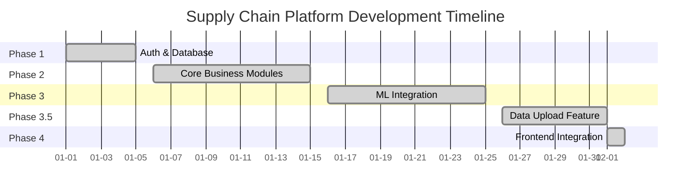

# Backend & Integration Roadmap

## Project Timeline

## Phase 1: Authentication & Database (Completed)
- [x] Switch to PostgreSQL for production-ready database
- [x] Fix login/registration flow API mismatches
- [x] Fix `/auth/me` endpoint User object bug
- [x] Verify full auth flow with persistence

## Phase 2: Core Business Modules (Completed)
- [x] Inventory Management CRUD (Verified)
- [x] Supplier Management CRUD (Verified)
- [x] Order Management CRUD & Schema Fix (Verified)
- [x] Connect Frontend to these endpoints (Completed in Phase 4)

## Phase 3: ML Integration (Completed)
- [x] Verify ML model training scripts (Fixed & Retrained)
- [x] Ensure models are loaded correctly by backend (Fixed pathing)
- [x] Test prediction endpoints (`/ml/predictions`, `/ml/run-analysis`) (Fixed schemas & types)
- [x] Check "Insights & Recommendation Engine" logic (Fixed deduplication & logic)

## Phase 3.5: User Data Upload (Completed)
- [x] Create `POST /upload/data` endpoint for CSV ingestion
- [x] Implement CSV parsing and DB update logic
- [x] Create Frontend `DataUpload` component
- [x] Integrate "Upload & Analyze" flow

## Phase 4: Frontend-Backend Integration (Completed)
- [x] Verify Frontend fetches real data (Dashboard, Inventory, Supplier pages connected)
- [x] Verify ML insights display on dashboard (Live from API)
